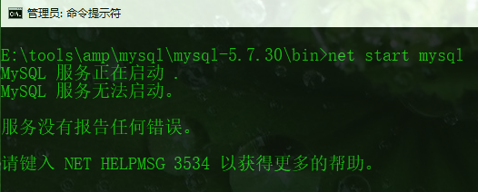

# 下载和安装

MySQL官网：[https://www.mysql.com/](https://www.mysql.com/)

- [Window](#Window)
- [mac](#mac)
- [Linux](#Linux)

---

## `window`

### `下载`

下载地址：[https://dev.mysql.com/downloads/mysql/](https://dev.mysql.com/downloads/mysql/)

进入下载位置和选择版本的步骤：

- 


- 


- 


- 


- 


- 


---

### `安装`

1. 在安装的目录下新建my.ini文件并写入(注意mysql目录位置要正确)：

```ini
[mysql]
# 设置mysql客户端默认字符集
default-character-set=utf8 
[mysqld]
#设置3306端口
port = 3306 
# 设置mysql的安装目录
basedir=E:/tools/amp/mysql/mysql-5.7.30
# 设置mysql数据库的数据的存放目录
datadir=E:/tools/amp/mysql/mysql-5.7.30/data
# 允许最大连接数
max_connections=200
# 服务端使用的字符集默认为8比特编码的latin1字符集
character-set-server=utf8
# 创建新表时将使用的默认存储引擎
default-storage-engine=INNODB
```


2.  以管理员身份运行E:\tools\amp\mysql\mysql-5.7.30\bin\mysqld install

这里若有以下报错：需安装 VC13

```
由于找不到 MSVCR120.dll，无法继续执行代码。重新安装程序可能会解决此问题
```

3. 运行 `net start mysql`，会报错



4. 以管理员身份运行 `mysqld --initialize-insecure --user=mysql` ，这时会多出data目录，在运行 `net start mysql` 成功启动服务


至此就已成功安装


1
1
1
1
1
1
1
1
1
1
1
1
1
1
1
1
1
1
1
1
1