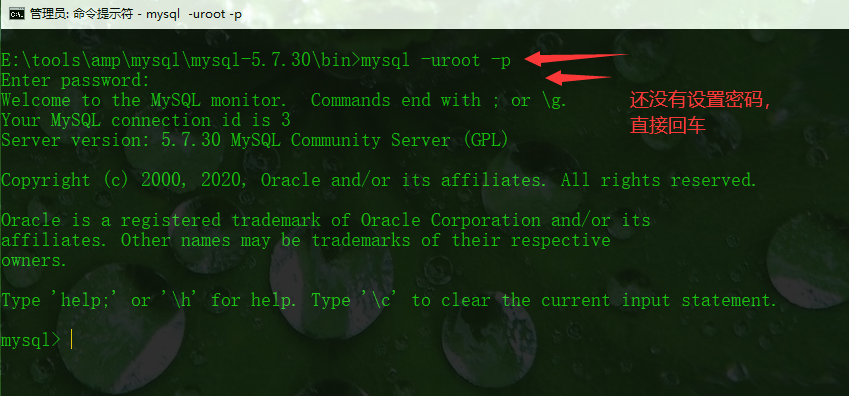

# 设置密码

安装完成之后，密码是空的，进入 MySQL 时可以不用密码



进入 MySQL 之后可通过以下命令设置密码

```
set password=password('123456');
```

exit: 退出重新登录

---

## 修改密码的4种方式

- 方法1： 用SET PASSWORD命令 

    首先登录MySQL。 

    格式：mysql> set password for 用户名@localhost = password('新密码'); 

    例子：mysql> set password for root@localhost = password('123'); 


- 方法2：用mysqladmin 

    格式：mysqladmin -u用户名 -p旧密码 password 新密码 

    例子：mysqladmin -uroot -p123456 password 123 


- 方法3：用UPDATE直接编辑user表 

    首先登录MySQL。 

    mysql> use mysql; 

    mysql> update user set password=password('123') where user='root' and host='localhost'; 

    mysql> flush privileges; 

- 方法4：在忘记root密码的时候，可以这样 

    以windows为例： 

    1. 关闭正在运行的MySQL服务。 

    2. 打开DOS窗口，转到mysql\bin目录。 

    3. 输入mysqld --skip-grant-tables 回车。--skip-grant-tables 的意思是启动MySQL服务的时候跳过权限表认证。 

    4. 再开一个DOS窗口（因为刚才那个DOS窗口已经不能动了），转到mysql\bin目录。 

    5. 输入mysql回车，如果成功，将出现MySQL提示符 >。 

    6. 连接权限数据库： use mysql; 。 

    6. 改密码：update user set password=password("123") where user="root";（别忘了最后加分号） 。 

    7. 刷新权限（必须步骤）：flush privileges;　。 

    8. 退出 quit。 

    9. 注销系统，再进入，使用用户名root和刚才设置的新密码123登录。


1
1
1
1
1
1
1
1
1
1
1
1
1
1
1
1
1
1
1
1
